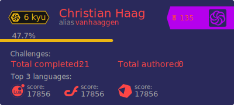

## ⚠ Disclaimer ⚠
This app is currently out of service. Heroku changed to a payment only platform and got rid of all free dynos. Sorry for the inconveniences.
-----
# Codewars Stat Badge/Card (WiP) 
This is not the original Codewars Badge, just a redesign I made for fun. 

## Options 

The URL has to contain the following queries to function properly:
- **username=**[your codewars username]
- **card** or **badge** (without value, just the key)
- **colormode=**[dark_mode or bright_mode]

## Examples
- #### ***Default mode*** 
   `https://github-readme-codewars-stats.herokuapp.com/api/?username=vanhaaggen&badge&colormode=dark_mode`
 
    
 
- #### ***bright_mode***
   `https://github-readme-codewars-stats.herokuapp.com/api/?username=vanhaaggen&badge&colormode=bright_mode`
 
    

- #### ***name_only***
  `https://github-readme-codewars-stats.herokuapp.com/api/?username=[your username]&badge&name_only`

    

- #### ***alias_only*** (combined with bright_mode)
  `https://github-readme-codewars-stats.herokuapp.com/api/?username=vanhaaggen&badge&alias_only&colormode=bright_mode`

    
 
 - #### ***Card*** 
   `https://github-readme-codewars-stats.herokuapp.com/api/?username=vanhaaggen&card&colormode=dark_mode`
   
   
---
 ## Customize your badge/card
 
`https://github-readme-codewars-stats.herokuapp.com/api/?username=vanhaaggen&[badge or card]&customcolor=[query-string]`
  The query options are:
  - bg (background)
  - fg (foreground)
  - text
  - secText (secondary text)
  - stroke (only in badge)
  - logo
  
  The query string is formated the following way:
  `customcolor=bg:[HEX code without #]`
  
  To join different options use underscore _:
  `customcolor=bg:[HEX code without #]_fg:[HEX code]_text:[HEX code]`
  
  ### Example Badge
  `https://github-readme-codewars-stats.herokuapp.com/api/?username=vanhaaggen&badge&customcolor=bg:2a295b_fg:b500ed_text:fc4646_logo:2a295b_stroke:f75402`
  
  
  ### Example Card
  `https://github-readme-codewars-stats.herokuapp.com/api/?username=vanhaaggen&card&customcolor=bg:2a295b_fg:b500ed_text:fc4646_logo:2a295b_stroke:f75402`
  
 
--- 
> Any suggestions or contributions are very welcome 😊
> - For suggestions please open a new Issue 
> - For contributions Pull-request

<svg class="octicon octicon-git-pull-request UnderlineNav-octicon d-none d-sm-inline" height="16" viewBox="0 0 16 16" version="1.1" width="16" aria-hidden="true"><path fill-rule="evenodd" d="M7.177 3.073L9.573.677A.25.25 0 0110 .854v4.792a.25.25 0 01-.427.177L7.177 3.427a.25.25 0 010-.354zM3.75 2.5a.75.75 0 100 1.5.75.75 0 000-1.5zm-2.25.75a2.25 2.25 0 113 2.122v5.256a2.251 2.251 0 11-1.5 0V5.372A2.25 2.25 0 011.5 3.25zM11 2.5h-1V4h1a1 1 0 011 1v5.628a2.251 2.251 0 101.5 0V5A2.5 2.5 0 0011 2.5zm1 10.25a.75.75 0 111.5 0 .75.75 0 01-1.5 0zM3.75 12a.75.75 0 100 1.5.75.75 0 000-1.5z"></path></svg>

## things to do:
- [x] Choose to display username. Default is both name and username.

- [x] If name return null, display username in big.

- [x] Make colors customizable.

- [x] Create codewars stat Card with more user info.

- [ ] Make a button to automate the deployement on diferent platforms.
...

[1]: https://img.shields.io/static/v1?label=heroku&logo=heroku&labelColor=9e7cc1&style=flat&message=&nbsp;&color=9e7cc1
