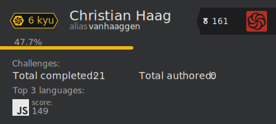

# Codewars Stat Badge/Card (WiP) 
This is not the original Codewars Badge, just a redesign I made for fun. Any suggestions are welcome 😊

⚠ The app is deployed on Heroku and it has a limit of 50 concurrent conections so, If you like it please 🙏 clone the repo and deploy it on your favourite platform. 

## Options 

The URL always has to contain either the `&card` or the `&badge`query.

- ### Default mode 
   `https://afternoon-wildwood-73334.herokuapp.com/api/?username=[your username]&badge`
 
    
 
- ### bright_mode
   `https://afternoon-wildwood-73334.herokuapp.com/api/?username=[your username]&badge&bright_mode`
 
    

- ### name_only
  `https://afternoon-wildwood-73334.herokuapp.com/api/?username=[your username]&badge&name_only`

    

- ### alias_only (combined with bright_mode)
  `https://afternoon-wildwood-73334.herokuapp.com/api/?username=[your username]&badge&alias_only&bright_mode`

    
 
 - ### Card default mode
   `https://afternoon-wildwood-73334.herokuapp.com/api/?username=[your username]&card`
   
   
---
 
## things to do:
- [x] Choose to display username. Default is both name and username.

- [x] If name return null, display username in big.

- [ ] Make color design fully customizable.

- [x] Create codewars stat Card with more user info.

- [ ] Make a button to automate the deployement on diferent platforms.
...
